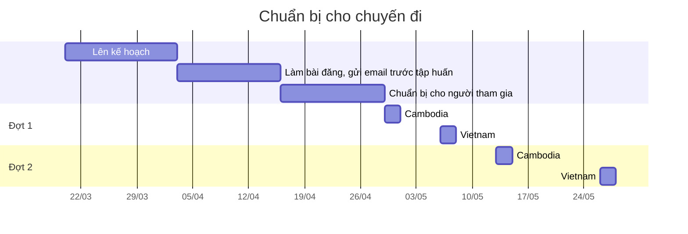

# 1 Lên kế hoạch
- [ ] [[Giới thiệu chương trình]]
- [ ] [[Phiếu đăng ký tham gia chương trình]]
- [ ] [[Danh sách người đăng ký]]
- [ ] [[Quỹ chương trình]]
- [ ] [[Kế hoạch hoạt động chi tiết từng buổi]]
- [ ] [[Đánh giá rủi ro]]
- [ ] [[Tài liệu về các bên liên quan]]

# 2 Bài đăng, email trước tập huấn
- [ ] [[Page Hé lộ chương trình mới]]
- [ ] [[Page Mở đơn chính thức]]
- [ ] Group Đăng bài trong các nhóm
- [ ] [[Page Những điều thú vị ở nơi sự kiện diễn ra]]
- [ ] [[Page Bật mí BTC]]
- [ ] [[Page Còn một ngày để đăng ký]]
- [ ] [[Email Thông báo kết quả ứng tuyển]]
- [ ] [[Page Thông báo kết quả email]] 
- [ ] Điện thoại Nhắc xác nhận tham gia
- [ ] [[Email Xác nhận cam kết tham gia]]
- [ ] Điện thoại Nhắc điền lịch
- [ ] [[Page Tập huấn sắp bắt đầu]]
- [ ] [[Page Bài truyền thông cho các bên liên quan]]

# 3 Chuẩn bị cho người tham gia trước khi đi
- [ ] [[Email Chốt lịch tập huấn và làm quen]]
- [ ] Làm [[Nội dung tập huấn online]]
- [ ] Tổ chức [[Buổi tập huấn online]]
- [ ] Tổ chức [[Buổi làm quen offline]]
- [ ] [[Page Recap buổi tập huấn]]
- [ ] [[Băng rôn, standee chương trình]]
- [ ] [[Group Thông tin cần nhớ trước khi đi]]
- [ ] Làm danh sách tham gia cuối cùng

# 4 Công việc trong chuyến đi
- [ ] [[Chuyến đi đợt 1]] 🛫 2023-05-06 📅 2023-05-08 
- [ ] [[Chuyến đi đợt 2]] 🛫 2023-05-26 📅 2023-05-28 
- [ ] [[Hợp đồng, biên nhận]]

# 5 Công việc sau chuyến đi
- [ ] Làm [[Phiếu lượng giá]]
- [ ] [[Email Thư cảm ơn các bên hỗ trợ]]
- [ ] [[Ảnh tổng hợp sau chương trình|Lọc ảnh]]
- [ ] Làm [[Giấy chứng nhận]]

# 6 Chuẩn bị cho chương trình năm sau

