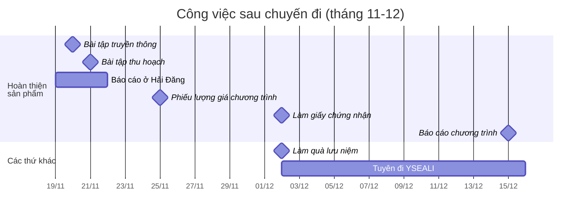

# Công việc sau chuyến đi

```mermaid
gantt
    dateFormat  D/M
	axisFormat  %d/%m
    title       Công việc sau chuyến đi (tháng 11-12) 
	
	Section Hoàn thiện<br>sản phẩm
	Bài tập truyền thông: milestone, 20/11, 0d
	Bài tập thu hoạch: milestone, 21/11, 0d
	Báo cáo ở Hải Đăng: 19/11, 3d
	Phiếu lượng giá chương trình: milestone, 25/11, 0d
	Làm giấy chứng nhận: milestone, 2/12, 0d
	Báo cáo chương trình: milestone, 15/12, 0d

	Section Các thứ khác
	Làm quà lưu niệm: milestone, 2/12, 0d
	Tuyên đi YSEALI: 2/12, 2w
```
# Lịch trình toàn bộ sự kiện Bước Chân 2022 (ngày) 

```mermaid
gantt
    dateFormat  D
	axisFormat  %d
    title       Lịch trình toàn bộ sự kiện Bước Chân 2022 (ngày) 
	
	Section Trước chuyến đi
	Tập huấn online: milestone, 5, 0d
	Bonding: milestone, 6, 0d
	Chốt danh sách, chuyển tiền: milestone, 8, 0d
	Di chuyển đến Phan Rang: milestone, 10, 1d

	Section Trong chuyến đi
	Ngày 1: day1, 11, 1d
	Ngày 2: day2, after day1, 1d
	Ngày 3: day3, after day2, 1d
	
	Section Sau chuyến đi
	Hoàn thiện sản phẩm sau chuyến đi: after day3, 19
	Báo cáo ở Hải Đăng: 19, 3d
```
# Lịch trình 3 ngày đi Phước Bình (giờ) 

```mermaid
gantt
    dateFormat  HH:mm
	axisFormat  %H
    title       Lịch trình 3 ngày đi Phước Bình (giờ) 
	
	Section Ngày 1<br>Đến với Phước Bình
	Di chuyển đến Phước Bình: done, 05:00, 2h
	Ăn sáng: done, 07:00, 1h
	Workshop SDG 1: ws1, 08:30, 1h
	Workshop SDG 4: ws2, after ws1, 1h
	Workshop SDG 5: ws3, after ws2, 1h
	
	Nghỉ trưa: done, after ws3, 2h
	Làm việc nhóm: chieu1, 13:00, 4h
	
	Ăn tối: done, toi1, after chieu1, 2h
	Hoạt động cuối ngày: after toi1, 2h
	
	Section Ngày 2<br>Tìm hiểu Phước Bình
	Ăn sáng: done, 07:00, 1h
	Workshop SDG 15: 08:30, 3h
	
	Nghỉ trưa: done, 2h
	Khảo sát cộng đồng: chieu2, 13:00, 4h
	
	Ăn tối: done, toi2, after chieu2, 2h
	Làm việc cùng thanh thiếu niên: after toi2, 2h
	
	Section Ngày 3<br>Hòa nhập cùng cộng đồng
	Ăn sáng: done, 07:00, 1h
	Giao lưu với học sinh: 08:30, 3h
	
	Checkout: done, 1h
	
	
```
